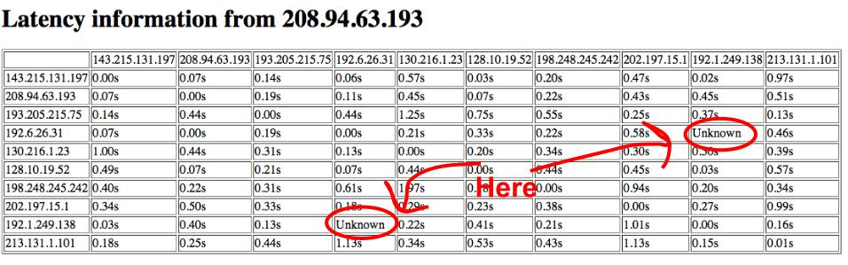

# Table of contents
[**Seattle Take Home Assignment**](#takehome)

[**Using the Clearinghouse website and the Seash**](#clearhouse)
1. [Step 1 : Adding resources](#step1)
2. [Step 2 : Running Seash](#step2)
3. [Step 3 : Browsing your resources](#step3)
4. [Step 4 : Hello World on a single computer](#step4)
5. [Step 5 : Hello World on many computers](#step5)
6. [Step 6 : Stopping programs](#step6)

[**Measuring Connectivity**](#connectivity)
7. [Step 7 : Sending UDP pings manually](#step7)
8. [Step 8 : Sending pings between a group of computers](#step8)
9. [Step 9 : Pinging behavior in the wide-area](#step9)
10. [Step 10 : Packet forwarding](#step10)
11. [Step 11 : Observed behavior from your home computer](#step11)
12. [Conclusion](#conclusion)

----

<br>
<a name="takehome"></a>
# Seattle Take Home Assignment

The purpose of this assignment is to illustrate several important networking concepts by measuring the connectivity between computers spread around the Internet.  For this task we will be using Seattle, and in the first part of this assignment you will familiarize yourself with the Seattle demokit.  Once you are comfortable with the demokit, we will run an all-pairs-ping on computers distributed around the world.   The goal of running the all-pairs-ping is to observe non-transitive connectivity (when two computers cannot communicate, but they can both communicate with a third computer).   Following this, we will set up one-hop detour routing to circumvent non-transitive connectivity to allow the computers to communicate through the intermediate node.   The final part of the assignment investigates whether or not a computer is behind a NAT (network address translator) and illustrates the practical issues with communicating with a NATed node.


When performing these steps, you are running software on end user machines around the world.   As such it is possible (but unlikely) that you may have a node fail as a user turns off their laptop, loses network connectivity, etc.   If so, you should be able to redo the previous step to continue with the assignment.

This assignment consists of 11 steps and should take between 30-120 minutes to complete.   Let's begin!

**Windows users:** You must have Python installed in order to run Seattle. For help installing the right version of Python, refer to our [Python installation instructions](https://seattle.poly.edu/wiki/InstallPythonOnWindows).

----
<br><br><br>

<a name="clearhouse"></a>
# Using the Clearinghouse website and the Seash
<br>

<a name="step1"></a>
## Step 1 : Adding resources
----

Login to the Seattle [Clearinghouse website](https://seattle.poly.edu/geni/).   If you don't already have an account (i.e. your instructor or TA gave you one) go ahead and register for an account.   Click on the My VMs tab and you'll see that you currently aren't using any resources.

In the top pane, select LAN and choose 5 VMs, and click "Get".  After a few seconds, you will see that five computers have been added for you to use.   If you can't obtain 5 LAN nodes, it is fine to use fewer.

At this point, you should have VMs  that you can use to run your code!
<br><br><br>

<a name="step2"></a>
## Step 2 : Running Seash 
----

Now click on the Profile tab, and download the demokit linked from this page.   Unpacking the zip file will create a directory that contains a shell called seash.py and a bunch of other files you need to do the take home assignment.   Click to download your Private Key and Public Key (save the files to the directory with seash.py).  This will give you the credentials necessary to run your programs on the computers now at your disposal.

 * On Windows do start, run, cmd and then cd to the folder where you downloaded the demokit.

 * On Mac / Linux, open a terminal window and change to the directory where you downloaded the demokit.

Then type "python seash.py" or "seash.py".   If these fail, you may need to [download python](http://www.python.org).   On Windows systems, you may also need to set your environment path to point to the copy of python you installed by clicking on Control Panel--> Systems--> Advanced Settings-->Environment Variables.

You will see a prompt like " !> " once seash starts.  Seash will allow you to easily run programs across multiple computers at the same time.
<br><br><br>

<a name="step3"></a>
## Step 3 : Browsing your resources
----

Now lets add the credentials you just downloaded from the website into seash.  Type the following command at the prompt, **(replacing ''username'' with the user name you used to log into the Seattle Clearinghouse website)**

```python
!> loadkeys username
```

Then, type

```python
!> as username
```

This will change the prompt to " username@ !> " to indicate that by default, you are now acting with your credentials.  Next, tell seash to search for VMs you control by typing browse:

```python
username@ !> browse
```

This will search for VMs that you control (so that seash can locate them).  You should see several VMs added (if not, you should wait a few minutes and then try again, as sometimes it takes
time for the VM information to propagate).  The output from browse command will look something like the following:

```python
username@ !> browse
Added targets: %1(IP:port:VMname), %2(IP:port:VMname), %3(IP:port:VMname), ...
Added group 'browsegood' with X targets
```

This tells you that the seash has discovered (at least some of) the computers you selected and verified that they are ready to run your code.
<br><br><br>

<a name="step4"></a>
## Step 4 : Hello World on a single computer
----

In the above print-out response to the browse command, the %1, %2, %3, etc are an easy way to refer to a computer.  For example, we can run a "hello world" program on computer %1 by typing:

```python
username@ !> on %1 run helloworld.repy
```

To see the results of this command on computer %1 we would type:

```python
username@ !> on %1 show log
```

This shows you the output from the %1 computer, which should say "Hello World". If you're going to deal with a specific computer over and over, then constantly typing "on computername" before every command can be very annoying.   You can instead set the default target by simply typing

```python
username@ !> on %1
```

and hitting enter.  This will change your prompt to be:

```python
username@%1 !>
```

This indicates that you're acting as your username and you're acting on %1 (unless otherwise specified).  Try typing

```python
username@%1 !> run helloworld.repy
```

and then type


```python
username@%1 !> show log
```

You'll see two "Hello World" lines now because you've run the program twice.
<br><br><br>

<a name="step5"></a>
## Step 5 : Hello World on many computers 
----

Now we'd like to run commands on more than one computer at a time.  To do this, we'll use the result of our previous browse command as a group.  If you recall the output from the command said "Added group 'browsegood' with X targets".  This means that the nodes it found the last time you browsed are now in a group called browsegood.   Type

```python
username@%1 !> on browsegood
```

and you'll see the prompt:

```python
username@browsegood !>
```

Now type two commands:

```python
username@browsegood !> run helloworld.repy
username@browsegood !> show log
```

You'll see that the command was run on a bunch of different computers.  Let's add the computers in browsegood to a group with a more convenient name by typing

```python
username@browsegood !> add browsegood to LAN
```

and then type

```python
username@browsegood !> on LAN
```

to use the LAN group.
<br><br><br>

<a name="step6"></a>
## Step 6 : Stopping programs
----

We'll cover one last function of seash before we start measuring network connectivity: stopping a running program. Some programs don't exit immediately like the hello world program.   At your " username@LAN !> " prompt type

```python
username@LAN !> run infloop.repy
```

This deploys a program that waits in an infinite loop.   Now let's try to run helloworld.repy while the previous program is running.

```python
username@LAN !> run helloworld.repy
```

The result is that you'll see ``` Failure 'Node Manager error 'Vessel has already been started'' on  ... ``` for each of the nodes.   The reason is that seash doesn't run the program since the infinite loop program is already running.  To stop the infloop program type

```python
username@LAN !> stop
```

You'll see a message noting that the program has stopped on your nodes.   To check the status of the program you deployed you can type "list" and it will show you if the program is running (Started), you stopped while it was running (Stopped), or stopped on its own (Terminated).   You may also have some VMs that have not been used (Fresh) or are in an error state (Stale).

It is common when using lots of distributed computers to have a few of them not function correctly, so it is normal to have a few in the wrong state after a command.   You can usually continue the series of operations and ignore the failed VMs or else retry the operation on the failed VMs.
<br><br><br><br>

<a name="connectivity"></a>
# Measuring Connectivity
<br>
<a name="step7"></a>
## Step 7 : Sending UDP pings manually 
----

Now we're ready to measure the connectivity between computers!   The first thing we need to do is check which UDP port we should use.   For convenience, Seattle Clearinghouse assigns the same UDP port to all of a user's VMs.

To figure out which port you should use, log into the Seattle Clearinghouse website and on the Profile page, look to see what port number it indicates.   **You should write down your port number as you'll need this value repeatedly.**

We'll measure connectivity by sending UDP pings from a target computer to a destination.  At the " username@LAN !> " prompt type

```python
username@LAN !> list
```

This will allow you to see the IP of %2.  Now type (replacing *port* with your port number)

```python
username@LAN !> on %2 run udppingserver.repy port
```

You can ping from %1 to %2 by typing the line listed below.   Replace *IP_of_%2* with the IP address of computer %2 as shown by your previous list command.   It will be something like 1.2.3.4.   Also replace *port* with your port number.

```python
username@LAN !> on %1 run udpping.repy IP_of_%2 port
```

Then if you type

```python
username@LAN !> on %1 show log
```

You will see that %1 was able to send UDP ping packets to %2. You can also type

```python
username@LAN !> on %2 show log
```

to see that %2 received the ping packets. Okay, now stop the udppingserver on computer %2 by typing

```python
username@LAN !> on %2 stop
```
<br><br>

<a name="step8"></a>
## Step 8 : Sending pings between a group of computers 
----

Instead of manually pinging between each of the computers in the LAN group, you can run a program that does an UDP ping between all of the computers in a group.  If your prompt isn't " username@LAN !> " type: "on LAN" to reset it.   First we need to generate a list of the IP addresses of the nodes. Type

```python
username@LAN !> show ip to neighboriplist.txt
```

This will write the IP addresses into a file called "neighboriplist.txt" on your computer.

Now type

```python
username@LAN !> upload neighboriplist.txt
```

This adds the file with nodes to ping to all of the computers in the LAN group. Now type (substituting your port for *port*)

```python
username@LAN !> run allpairsping.repy port
```

You can see the result of all of the nodes pinging each other by opening your web browser and pointing it at one of the computers in your neighboriplist:port.   For example, if 1.2.3.4 is a computer in your list, and your port is 54321 then open your browser and in the address bar type "http://1.2.3.4:54321".   If the node you chose doesn't respond, try another node.

Each node reports a matrix showing its connectivity. You will see that every node is able to ping every other node (i.e. the matrix is full of latencies).   If a row is completely missing, you'll notice the corresponding column is likely empty as well.   This indicates that the node you are looking at is mostly likely down.

If you refresh the page occasionally, you'll see that the latencies change as the nodes periodically update.
<br><br><br>

<a name="step9"></a>
## Step 9 : Pinging behavior in the wide-area 
----

Now we'll run the all pairs ping on computers distributed around the world. Log back into the Seattle Clearinghouse website. You will see the nodes that you're using are listed under the My VMs tab. Click on "remove all".  Now that you've given back your resources, you can add other resources. Under the My VMs tab, in the "Get more resources" pane, select WAN (instead of LAN), choose 10 computers, and click "Get".   Now you'll see that ten computers / VMs around the world have been added for you to use.

Back in seash, type

```python
username@LAN !> browse
```

You will see that the WAN nodes are now detected.  For convenience, let's add the nodes to a group called WAN by typing

```python
username@LAN !> add browsegood to WAN
```

If you have only a few nodes, wait a few minutes, then do ```browse``` and ```add browsegood to WAN``` again.  Now type

```python
username@LAN !> on WAN
```

and the prompt should now say "username@WAN !>".  If you are curious, you can find out where the computers are located by typing:

```python
username@WAN !> show location
```

Now let's examine the all pairs connectivity again. First type

```python
username@WAN !> show ip to neighboriplist.txt
```

and as before this will write the IP addresses to a local file called 'neighboriplist.txt'. Then type

```python
username@WAN !> upload neighboriplist.txt
```

Then type

```python
username@WAN !> run allpairsping.repy port
```

Finally, check the result of all of the nodes pinging each other by opening your web browser and pointing it at one of the computers in your neighboriplist:port.   If you can't see this from a specific node, try to refresh a few times.   You should try to load the webpage of a different computer if the problem persists.

What do you observe? Is the connectivity graph complete and do all of the nodes agree on which nodes are alive?  As before, a column which is empty and has a corresponding empty row indicates a down node.   Do you see any nodes that cannot connect to each other but can contact other nodes?   If so you'll see something like the image below.



Notice that the two computers whose IP addresses are circled cannot talk to each other, however they can talk to other nodes.   If you don't see this, then you can either continue to the next step and pretend you had nodes that could not communicate or you can get a new group of nodes and try again.  (One way of locating non-transitive connectivity quickly is to donate resources to Seattle so you can try 20 VMs at a time.)   If you decide to try again, you should use a different group name than WAN (like WAN2) to refer to the nodes so that seash doesn't try to contact the nodes you aren't using any more.

Stop the allpairsping on the WAN nodes so we can focus on the nodes with non-transitive connectivity.
```python
username@WAN !> stop
```
<br><br>

<a name="step10"></a>
## Step 10 : Packet forwarding 
----

Now that you have a connectivity matrix where there are two nodes that can't communicate, notice that other computers can communicate with these nodes, but they can't contact each other directly. This is an effect called "non-transitive connectivity".   Non-transitive connectivity usually happens because of configuration errors or convergence failures in the BGP protocol.

Write down the IP addresses of the two computers that cannot directly communicate and also write down the IP of a node that can communicate with both nodes.   To get packets to flow from two nodes that can't communicate, we can have a node in the middle forward packets.   Find the %number of the node who can talk to both nodes.   Then type (replacing *node1IP*, *node2IP*, and *port*)

```python
username@WAN !> on %number run udpforward.repy node1IP node2IP port
```

Now start the udppingserver on node1 by doing (replacing *%node1* with the node number for node1 and *port*)

```python
username@WAN !> on %node1 run udppingserver.repy port
```

To send a ping packet, run: (replacing *%node2* with the node number for node2, *intermediateIP* with the IP address of the computer that can talk to both nodes, and *port*)

```python
username@WAN !> on %node2 run udpping.repy intermediateIP port
```

You can look at the log on node1 or node2 to see that the packets were delivered (using the "show log" command).   However, on node2 you'll notice that the ping packets came from the intermediate IP address instead of node1.   You'll also see that node1 got the response from the intermediate node (instead of directly from node2).

```python
username@WAN !> on %node2 show log
```

```python
username@WAN !> on %node1 show log
```
<br><br>

<a name="step11"></a>
## Step 11 : Observed behavior from your home computer 
----

The next part of the assignment is best performed from your home computer.  It will try to detect the presence of a network address translator (NAT); a feature that many wireless modems and home routers have.  You will need to download the demokit and keys like you previously did in Step 2.

If you can't run Repy on your home computer, you can also obtain a computer using Seattle Clearinghouse.   If you use Seattle Clearinghouse, choose a node of type NAT.   You will need to change the below directions so that you use seash to run commands on the NAT node instead of running the programs locally.

Either way, run seash from a terminal by typing "python seash.py" or "seash.py".  Load your keys by typing (replacing *username* with your Clearinghouse user name)

```python
!> loadkeys username
```

Then type

```python
!> as username
```

and you'll see the prompt changes to "username@ !>".

Check on the Seattle Clearinghouse website to see if you still have nodes to use.   If not, under My VMs, select WAN, choose 1 computer, and click "Get".

Now under seash at the " username@ !>" prompt, type

```python
username@ !> browse
```

You should see the IP of at least one WAN node. Write down the IP address of the WAN node.   Write down the IP address of your computer (you can obtain this by typing "ipconfig" at a prompt in Windows, by typing "hostname -i" on Linux, or by typing either ```"host `hostname`"``` or ```ifconfig``` on a Mac).   Start the pingserver on the WAN node with the following command in seash (replacing *port* with your port number):

```python
username@ !> on %WANnode run udppingserver.repy port
```

Ping the WAN node from your local computer by typing the following command at a terminal window (not in seash!) after you cd to the directory the demokit is in.   Remember to replace *WANIP* with the WAN node's IP address and *port* with your port.   If you are running this on a remote system, you should use seash and replace the ```python repy.py restrictions.allowallports``` portion of the command with 'run'.


```python
python repy.py restrictions.allowallports udpping.repy WANIP port
```

Now look at the log of the WAN computer.

```python
username@ !> on %WANnode show log
```

Does it have your computer's IP address listed as the source address?  If not, you have network address translation changing your IP address.

Now try to ping in the opposite direction.  First, stop the pingserver on the WAN node

```python
username@ !> on %WANnode stop
```

Then start the ping server on the local computer by running the following command from the terminal window (not in seash!).   Once again, if you are running this on a remote system, you should use seash and replace the ```python repy.py restrictions.allowallports``` portion of the command with 'run'.


```python
python repy.py restrictions.allowallports udppingserver.repy port
```

Next ping the local node from the WAN node

```python
username@ !> on %WANnode run udpping.repy localIP port
```

Then check the log by running

```python
username@ !> on %WANnode show log
```

Did it work?

If you have a NAT device on your home network your computer can initiate connections out, but the packets will be translated so they have a different IP address than the local IP.   This also typically means that nodes on the outside of the NAT cannot initiate connections to inside nodes (which is why the WAN node could not ping your computer).

If you have a firewall, your home computer may not be able to receive incoming connections or packets.   However, a non-NAT firewall will not change your IP address.
<br><br><br>

<a name="conclusion"></a>
## Conclusion 

That's all for the take home assignment.   You've just seen non-transitive connectivity in practice, used one hop detour routing to circumvent it, and also determined if your computer is behind a NAT.   We hope this has been informative and enjoyable.   If you would like to [donate resources](../UnderstandingSeattle/DonatingResources.wiki) to the Seattle project, you call install Seattle on your home computer.   Clicking on the Get Donations tab from your Seattle Clearinghouse account and picking the appropriate installer to download will credit the donation to your account.   If you have any comments or questions please contact justinc -AT- cs -DOT- washington -DOT- edu
