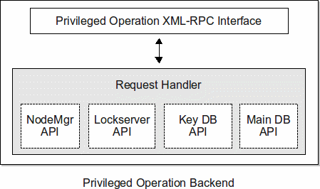

# SeattleGeni Design Document/Proposal

This is a proposal for the rewrite of SeattleGeni. Feedback welcome (e.g. comments here, to jsamuel, or to the list).

## Design Goals

  * Greater understandability and maintainability.
    * Current design is more difficult than necessary for new people to understand.
  * Easier testing.
    * Current design's lack of modularity makes testing difficult.
  * Better logging.
    * Design not only needs to incorporate better logging, but needs to allow easy future addition of logging.
  * Eliminate race conditions.
    * Current implementation has various race conditions related to database access.
  * Improve security.
    * Minimize the impact of website/webserver compromise.

## New Design Plan

At a high level, the idea will be to:
  * Redesign the data model to more accurately represent the current (and likely future) data to be stored.
  * Implement a Lockserver that will be used by all other components of the system to ensure mutual exclusion in modification of data as well as node communication.
  * Move all private keys used by SeattleGeni to a separate Key DB that the Website cannot access.
  * Rewrite/refactor code for readability, ease of testing, locking, logging, etc.
  * Keep the existing separate Backend server and give it the responsibility for privileged operations requiring the usage of private keys.
    * The Backend will be formally called the Privileged Operation Backend.
  * All nodemanager communication the Website needs done will go through the Backend.
    * Such communication requires signing by keys stored in the Key DB, to which the Website does not have access.

### Website

Overview:
  * End clients communicate with the Website through either XML-RPC or HTTP.
  * The request's authorization is checked (e.g. ensure valid session for HTTP) and
    the request is then sent through the Controller Interface.
  * The Controller then processes the request based on the type of request.
    * The Controller will handle as much of the work as it can given the limitation that, as it
      is part of the Website, it cannot perform nodemanager calls directly or access arbitrary keys.
      * The Controller will leverage the Privileged Operation Backend (through the Privileged Operation API)
        to perform actions that it cannot perform directly.
        * For example, a request for a user to acquire/release vessels will ultimately require using
          the Privileged Operation API in order to perform the required nodemanager calls.
    * The Controller will do locking through the Lockserver as needed.

APIs used:
  * Privileged Operation API
    * This handles communication with the Privileged Operation Backend.
  * Keygen API
    * This handles communication with the Keygen Service.
      * The Keygen Service is not the same thing as the Key DB API!
      * The Keygen Service's main purpose is to provide unique keys when new keys are needed in order to prevent the keys needing to be generated in all client code in real time.
  * Lockserver API
    * This handles communication with the Lockserver.
  * Main DB API
    * This performs any required database operations involving the Main DB.

### Privileged Operation Backend

Overview:
  * The Privileged Operation Backend (a.k.a. "the Backend") performs fundamentally the same purpose as the current backend implementation, which is the performing of nodemanager communication indirectly resulting from user requests.
    * The primary motivation for this is that Website will be an unprivileged component of the system without access to privileged keys, which are needed for nodemanager communication.
  * The Backend exposes a private XML-RPC interface for use by other code within the system,
    including the Website and Polling Daemons.
    * The nodemanager communication the Polling Daemons need to perform may or may not be moved to the Backend.
      * The possible reasons to do so include:
        * Being able to have the Polling Daemons be untrusted components (e.g. run in less secure environments)
        * Allow the Backend to more efficiently handle nodemanager communication.
          * Example: background releasing of VMs while maintaining locks on those VMs. This may not be the greatest example, but ideas along these lines may be easier to implement if the nodemanager communication is kept in one place.
  * The Backend will do locking through the Lockserver as needed.

APIs used:
  * Geni Nodemanager API
    * This does the actual node communication.
    * This is just a simple wrapper around the nmclient.
  * Lockserver API
    * This handles communication with the Lockserver.
  * Key DB API
    * This is used for accessing the Key DB that stores private keys (which are needed for signed nodemanager communication).
  * Main DB API
    * This performs any required database operations involving the Main DB.

### Lockserver

The Lockserver exposes a private XML-RPC interface for use by other code within the system,
including the Website, Backend, and Polling Daemons. The purpose is to allow client code
to be guaranteed exclusive access to some parts of the system.

  * The following lock types will exist:
    * ''global''
      * excludes the granting of any other lock
      * there should be few or no cases where this is needed in client code, but could be useful for maintenance tasks, for example.
    * ''user''
      * used for most user-initiated actions to ensure sequential ordering of multiple requests by the same user.
      * when sharing is implemented, it will likely be necessary to obtain multiple user locks at the same time
      * examples of cases where used:
        * user key change
        * user resource acquisition/release
        * user deletion
    * ''node''
      * node locks must be obtained anytime operations on a node or any of its VMs are performed.
      * examples of cases where used:
        * node state transition scripts
        * user key change
        * user resource acquisition/release
  * Preventing deadlock
    * Within any individual process, user locks must be obtained before node locks.
      * This means that if a process has obtained a node lock, it cannot then obtain a user lock until after releasing the node lock.
      * The term ''process'' is used loosely here (see discussion of Lockserver session identifiers below).
    * Multiple locks of the same type (locks on multiple users or nodes) must be requested at the same time.
      * Once a process holds a node lock, it cannot request a lock on a different node until after it has released the first node lock.
  * Lockserver session identifiers
    * When a process communicates with the Lockserver, it will provide with each request a session identifier that is understood by the Lockserver.
    * The session identifier allows the Lockserver to determine whether the client code is performing an illegal request (e.g. requesting a user lock while still holding a node lock).
  * Lock request will be granted sequentially.
    * When some locks are held, subsequent requests for non-conflicting locks will be granted.
    * When a request is made for a lock that is already held, thus causing the request to block,
      all subsequent requests by all processes will be queued (that is, will block) until the
      first waiting request can be granted. 
      * Non-conflicting pending requests can't be safely granted out of order because it might cause starvation of
        some requests -- at least, it can't be done with simple logic and we won't attempt it.
  * Initially the Lockserver will be implemented in the simplest manner possible and client code will only
    make use of blocking lock requests.
    * When it is determined to be needed for efficiency or other
      reasons, the Lockserver can be extended to allow client code to perform more advanced requests, such as
      non-blocking lock requests that will return a lock acquisition failure if the lock can't be granted immediately.

### Polling Daemons

Polling Daemons are any processes or scripts that perform general monitoring of nodes
as well as node state transition functionality. These processes communicate with nodes
directly through the Node Manager API unless there is shared functionality that has
reason to exist in the Backend.

APIs used:
  * If Polling Daemons do not perform node communication through the Backend, they use the same APIs as the Backend.
  * If Polling Daemons use the Backend for node communication and thus can be run as unprivileged (or less-privileged) code, then they would not use the Geni Nodemanager API or the Key DB API but rather the Privileged Operation API.

## An Example Request Being Handled

A user requests new VMs/vessel through the website (either through HTTP or XML-RPC).

''In the Website''

The details of the request are passed to the Controller Interface (which is part of the controller, but is the only part of the Controller directly communicated with by the HTTP or XML-RPC frontends).

The Controller sees that the request needs to have a ''user'' lock and obtains one through the Lockserver API (blocking until the lock is obtained).

The Controller determines whether the user is allowed the requested resources (that is, whether or not the user already has too many acquired VMs). If not, the user lock is released and a proper response is returned to the frontend.

The Controller determines whether there are sufficient resources available to fulfill the request and, if so, which resources (e.g. specific VMs) those are. This is done without locking and so there is no guarantee at this point that the resources will be able to be acquired for this user. If there are not sufficient resources, the user lock is released and the proper response is returned to the frontend.

At this point the Controller knows a set of VMs it wants to acquire for the user. The Controller repeatedly uses Privileged Operation API calls to acquire the needed individual VMs for the user. (If implemented in this way where the Controller does not first obtain a node lock, then the Controller must include its Lockserver session id in Privileged Operation API calls in order for the Backend to be able to use the same Lockserver session id.)

''In the Backend''

The Privileged Operation Backend receives the request (through its XML-RPC interface) to assign a specific VM to a specific user.

The Backend obtains a lock for the node that the VM is on through the Lockserver API (blocking until the lock is obtained).

Now that the Backend has a lock for the VM's node, it uses the Database API to determine if the VM is available for assignment to a user (that is, ensure it is not assigned to another user, ensures the correct port for the user exists on the VM, ensures that the node the VM is on is considered active, etc.). If the VM is not available for assignment, the node lock is released and a proper response is returned (which in this case is a response to the Controller).

The Backend uses the Geni Nodemanager API to perform a ChangeUser on the VM. If the call fails, the Backend releases the node lock and returns a proper response.

(The Geni Nodemanager API is used in combination with the Key DB API to perform signed nodemanager communication.)

Once the ChangeUser call to the nodemanager is complete, the Backend uses the Database API to update the database to indicate this VM's assignment to the user. (If the system crashes before this is complete, the user's key will have been set on the VM but there will be no record of this in the database, so the vessel will retain the user's key until it is assigned to another user, barring cleanup that may take place by outside scripts which detect this issue).

The Backend then releases the lock on the node and responds to the Website that the acquisitions was successful.

''In the Website''

The Controller repeats the process of using the Backend to acquire VMs for the user. When acquisitions fail, the Controller does its best to try to accommodate the request until it is no longer possible to fulfill the request. If it is no longer possible to fulfill the request, the Controller makes calls to the Backend to release each VM that had been successfully acquired. If the system crashes during the individual VM acquisition/release process, the result will be that the user account will be left in a valid state but with a partial set of the resources they had requested, which is an acceptable failure effect.

When the Controller has finished (either by giving up and releasing any acquired VMs or by acquiring the desired VMs), the Controller releases the user lock and returns a proper response to the frontend so that the frontend can give the appropriate response to the request (either HTTP or XML-RPC, however the request came in).

## Logging

Logging will be available in multiple ways:
  * Request/Response available via [django middleware](http://docs.djangoproject.com/en/dev/topics/http/middleware/).
  * Logging at the controller interface will be possible (allows logging requests/response, recording time, etc. independent of frontend -- though much of this may be taken care of by the backend when processing the queue).
  * Use of the python logger module (no calls to "print", ever).
  * Email critical errors to developers (include request/response information).
  * Lockserver logging requests including how long released locks were held. Potentially notify developers if a lock has been held an unusual amount of time.
  * API call logging that can be enabled as needed.
    * For example, ability to enable logging of calls to the Privileged Operation API, Nodemanager API, Main DB API, Key DB API, etc.
    * Possibly implemented using python function annotations.

Ultimately, various logged information should be summarized and available through a website so that the status of the site can be easily monitored. Log files by themselves tend to not be looked at by humans except after something is known to be going wrong. Where possible and efficient, some data may be logged to a database in order to facilitate easy summarization of the data (this wouldn't replace file logging).

Whether logged to a database or text files, a summarization/visualization of log data helps to identify logic bugs or other problems in the system. For example, there may be no critical exceptions happening but an unusually high percentage of VM acquisition requests are not able to be fulfilled. Such a situation would be better seen through a summary of results of calls that pass through the controller interface rather than waiting for the bug to be noticed directly.
 
## Testing

  * Unit tests at various locations, for example:
    * frontends (using [django test framework](http://docs.djangoproject.com/en/dev/topics/testing/))
    * Controller
    * Lockserver
    * Backend
  * Test data:
    * make use of [fixtures in django](http://docs.djangoproject.com/en/dev/topics/testing/#fixture-loading)
  * Dependency injection to increase testability using mock objects:
    * the various APIs used by the Website and Backend (as well as other components) should each be able to be mocked out in order to test a component independent of actions performed by the APIs used in the component.
      * for example, the Controller should be able to be tested using a mock Privileged Operation API, mock Keygen API, mock Lockserver API, and mock Main DB API in order to allow testing of only the Controller.
    * will not be aiming for idealized testability in design where that conflicts with the coding style of the project
      * monkey patching is ok if code changes for dependency injection don't fit well
      * testability is more important than test code style

## Database / Data Models

It is likely that we'll use the django ORM rather than something more full-featured and complex like SQLAlchemy. The benefits of a more complex ORM would largely be for efficiency at the cost of clarity and maintainability. The drawbacks of using django's ORM may be more database round trips as well as more frequently resorting to raw SQL. The benefit of using django's ORM will likely be code that is easier to understand in the common case. The models defined below do not seem to be complex enough such that they will be limited by what django's ORM lacks. Using the django ORM has the benefit of allowing use of the django admin data views, as well.

The details of the models (database schemas) are below.

### Main Database

  * GeniUser
    * purpose:
      * A GeniUser record represents a SeattleGeni user. This class extends the django.contrib.auth.models.User class.
    * fields:
      * usable_vessel_port
        * the port which must be assigned to a vessel/VM for the user to be able to acquire that VM.
        * this field may go away later on if users are no longer always assigned to the same port on all VMs.
      * affiliation
        * the text the user supplied which identifies the organization they are affiliated with.
      * user_pubkey
      * user_privkey
        * this is not stored in the Key DB because the Website needs access to it and it is not used by us.
        * the private key will only be stored when the the user has had us generate their keys.
          * the user will be encouraged through the Website to download this private key and have us delete our copy of it.
      * api_key
        * this is not a cryptographic key
        * this is an API key that we generate which can be used with the public SeattleGeni XML-RPC interface.
        * the purpose is to allow developers to use the XML-RPC interface without requiring them to embed their passphrase in their source code.
      * donor_pubkey
        * the corresponding private key is always stored in the Key DB and is accessible using this public key.
    * notes
      * For efficiency reasons, additional fields may be added to keep cached values for the amount of resources the user has donated and has acquired, rather than requiring calculating this information on demand.
        * This will be avoided until it becomes truly necessary.

  * Node
    * purpose:
      * A Node record represents an individual nodemanager. When a node goes offline, it is marked inactive. Node records are never deleted because if they were and a node with a delete node's node_identifier came back online, the owner private key would have been lost.
    * fields:
      * node_identifier
        * the node's identifier (which happens to be a public key with no corresponding private key)
      * last_known_ip
        * the ip address the nodemanager was last known to be accessible through.
      * last_known_port
        * the port the nodemanager was last known to be accessible through.
      * last_known_version
        * the version of seattle the node was last known to be running.
      * date_last_contacted
        * the last time the node could be contacted by a monitoring script.
      * is_active
        * the node gets marked as not active when it becomes inaccessible.
      * owner_pubkey
        * the SeattleGeni's owner key for this node.
         * the private key is always stored in the Key DB and is accessible using this public key.
      * extra_vessel_name
        * the extra vessel/VM will (at least in the near future) have the node's free resources assigned to it, so the name needs to be known in order to do things with those resources.
    * notes
      * The subnet will be calculated as needed rather than stored unless the database impact is too high. If it needs to be saved, it will be an indexed string field. (The current implementation as the concatenated first three octets without periods looks flawed unless I'm reading it wrong).

  * Donation
    * purpose:
      * A Donation record represents the resources a user has donated from a single node.
    * fields:
      * node (foreign key to nodes table)
      * donor (foreign key to the users table)
      * status
        * This field will be used, if necessary, to indicate steps in the process of setting up a donation's resources for use (which, for now, would be creating vessels on the corresponding node using this donation's resources).
      * resource_description_text
        * Simple storage of the contents of a resource file describing the donated resources.
        * This information is not currently used anywhere. How this data is stored may change in the future and this field just serves to start keeping track of the information for now.
    * notes
      * In the future, there may be more than one donor of a node and so multiple Donation records for a single node but each with different donors. For now it will be used as just one donation record per node record.

  * Vessel
    * purpose:
      * A vessel record represents a VM that SeattleGeni has setup on a node. Note that this is **not** tied to an individual donation of resources from that node.
    * fields:
      * node (foreign key to the nodes table)
      * name
        * the name used to refer to the VM when communicating with the nodemanager
      * acquired_by_user (foreign key to the users table)
        * if this VM has been acquired by a user, this is the user who acquired it
      * date_acquired
      * date_expires
        * the date after which the VM should be taken away from the user who has acquired it.

  * VesselPort
    * purpose:
      * A VesselPort record represents a port that is assigned to a vessel/VM. A single VM can have multiple ports assigned to it (multiple VesselPort records).
    * fields:
      * vessel (foreign key to vessels table)
      * port

  * VesselUserAccessMap
    * purpose:
      * A VesselUserAccessMap record represents user access to VMs. This is a many-to-many relationship. The user who acquired the VM will always have a mapping to that VM. In the future when additional users can be added to a Vessel through SeattleGeni, the additional users would have records here.
    * fields:
      * vessel (foreign key to vessels table)
      * user (foreign key to users table)

There will likely be additional tables for logging.

### Key Database

  * Key
    * purpose:
      * A Key record represents a public/private key pair. Keys are referenced by the public keys themselves. A keypair only needs to be stored here if there is need to store a private key.
    * fields:
      * pubkey
        * the way the client code using the Key DB API refers to this key.
      * privkey
        * this will always be set for any record, as there is no reason to only store just a public key.
      * usage_identifier
        * a unique name in the SeattleGeni system where this key is used.
          * for example, this would identify a given key is a specific user record's donor key ("user:123:donor").
        * this is only for additional consistency checking (e.g. to allow an additional way to look for invalid/unused/missing key mappings) and general informational purposes. 
        * this may end up only being read by separate scripts, never in normal usage, but seems useful to track just in case it's needed.

### Model Notes

  * **Indexing**
    * The current database schema does not appear to make use of additional indexes for performance.
    * In the above models I haven't discussed specific indexes to be added to tables, but these won't be forgotten. Indexes will be added where logical and should be tested using a large database with performance profiling.
  * **Vessel acquisition**: If a user acquires a VM, the VM counts towards that user's VM limit. In the future, limits may be by resources (e.g. diskspace) rather than number of VMs.
  * **Vessel releasing**: Releasing a VM/vessel means to clear the list of users with access to the node and to return the VM credit to the user who had acquired the VM. (The VM may be reset, etc.)
  * **Vessel multi-user access**: A VM can be accessible to multiple users even though it is always acquired by a single user. Whether any user with access to the VM can release it is not specified here and can be decided later. The simplest initial implementation is probably to allow any user with access the ability to release the VM, so initial implementation will probably use that approach. (Adding additional users to a VM may not be available through the UI for this version, but the functionality will be easy to implement.)
  * **Sharing**: allowing other users to create VMs against your available resources is not re-incorporated in the design at this time.
