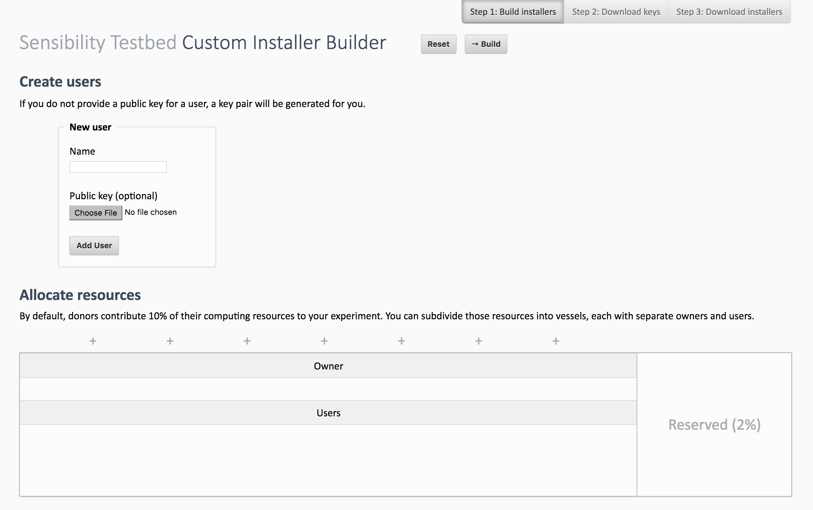

# Using the Custom Installer Builder

Normally, installers created through Seattle Clearinghouse subdivide a donor's resources into two VMs. As always, there is a small VM (20%) reserved for Seattle itself. The main VM (80%) is owned by the experiment planner, and a special key is entered for the VM user. This special key allows anybody to download a customized installer (provided through Seattle Clearinghouse) and donate their computing resources to the planner's experiment.

If the experiment planner wants to further subdivide the VMs, he can use the Custom Installer Builder (e.g. [Seattle's](https://custombuilder.poly.edu/custom_install/) or [Sensibility Testbed's](https://sensibilityclearinghouse.poly.edu/custominstallerbuilder/)). This tool allows the planner to create several smaller VMs in place of the larger main VM. Each VM can be assigned a particular owner and a number of users. Because working with cryptographic keys is awkward, the Custom Installer Builder can accept public keys from files, or generate new key pairs entirely.

On the backend, there is also an [XML-RPC interface](API.md) to create customized installers. (In fact, this is how Seattle Clearinghouse generates the default installers it provides.)

# A Tour of the Web Interface

Start by opening [Seattle's](https://custombuilder.poly.edu/custom_install/) or [Sensibility Testbed's](https://sensibilityclearinghouse.poly.edu/custominstallerbuilder/) Custom Installer Builder in your web browser.

## Step 1 : Build Installers
First, **create users** in the top half of the page. You can upload a public key for existing users, or allow the Custom Installer Builder to generate cryptographic keys for you.

Next, **create your VMs** by splitting the main VM as you see fit. VMs can be split by clicking one of the "+" icons along the top edge. You can delete a created VM by clicking the "×" icon in its upper-right corner.

Finally, **configure your VMs** by dragging users from the top half of the page into the VMs created in the previous step. Each VM must have a single owner, but may have any number of users. When you are ready, **press the "Build" button** to move to the next step.

## Step 2 : Download keys
Before you can download your installers, you must download the cryptographic keys for the users created in the previous step. These keys are not stored on our server after your browsing session expires.

## Step 3: Download installers
After you have downloaded the cryptographic keys, you are ready to download your installers! A link is provided to share these installers with others.
